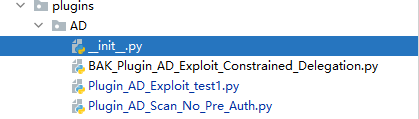
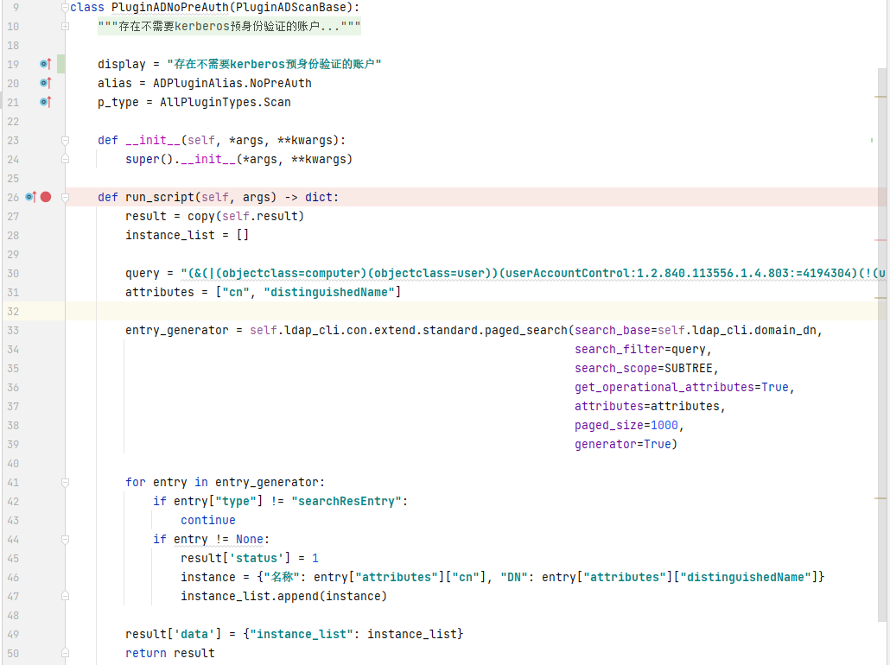
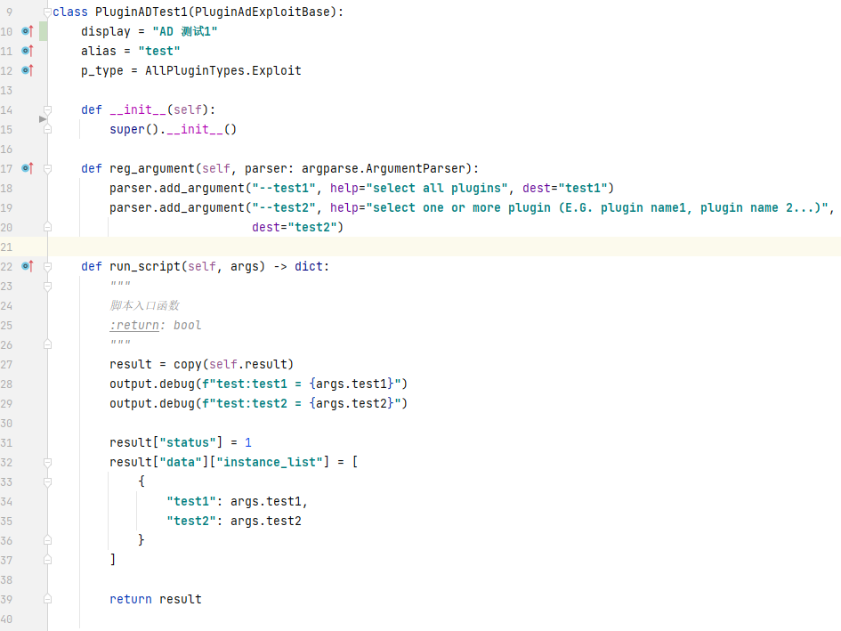
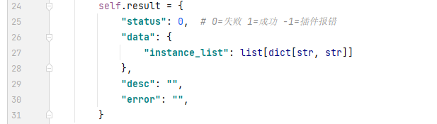
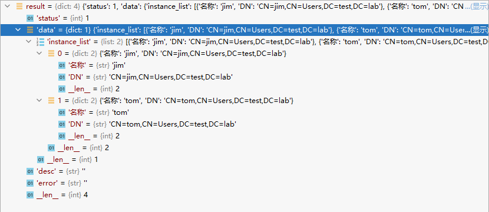

## Example

显示可用模块

```bash
./main.py -h
```

## 插件编写规范

### 创建插件

插件脚本需存放在对应模块目录中，脚本文件名以`Plugin_[模块类型]_[扫描类型]_模块名称`.py命名，任何不以`Plugin_`开头的文件都会被忽略

`模块类型`与模块目录名称对应，`扫描类型`可以选择`Exploit`/`Scan`，具体是脚本功能而定。

下图中，AD模块存在2个插件，漏洞利用类型**test1**脚本和**No_Pre_Auth**脚本，**BAK_**文件会被忽略不加载。



### 扫描插件编写

- 插件类需以`Plugin`开头
- 插件类需要继承模块基类（具体视模块而定）
- 重写`display`、`alias`、`p_type`字段(各个字段的含义可以看`PluginBase`中的注释)
- 重写`run_script()`插件入口函数

如下图定义扫描插件`PluginADNoPreAuth`，继承`PluginADScanBase`，重写`display`等字段。
重写`run_script()`函数（这个函数是所有插件的入口函数），并将结果以字典形式返回。返回结果的结构在`PluginBase`也有注释



### 漏洞利用插件编写

- 插件类需以`Plugin`开头
- 插件类需要继承模块基类（具体视模块而定）
- 重写`display`、`alias`、`p_type`字段(各个字段的含义可以看`PluginBase`中的注释)
- 重写`reg_argument()`函数注册插件所需参数
- 重写`run_script()`插件入口函数

如下图创建AD插件，重写相关字段后在`reg_argument()`函数中注册插件所需参数，获取参数的值在`run_script()`函数`args`参数中，以`args.[定义的参数]`这种形式获取，最后将结果输出。



### 扫描结果返回

所有插件的返回结果以如下图形式返回，每个字段含义如下：
`status`: 插件运行状态，1=成功；0=失败；-1=插件报错
`data`:插件运行结果，以字典形式存储



示例返回结果如下：



## 目录结构

- doc (帮助文档的图片)
- logs (工具执行的日志文件)
- modules (模块目录，存放工具其他框架)
- **plugins** (插件目录，存放扫描/漏洞利用插件)
- template (模板目录，存放html输出结果的模板)
- utils (工具用到的函数目录)

###  plugins

`plugins`目录下的每一个子目录都代表一个具体的场景模块，每个模块目录中都存在一个`__init__.py`脚本，该脚本中定义了模块名称、插件注册函数、模块基类。

### utils

这个目录存放的是插件可能用到的函数。最常用的是打印到控制台类**output**

## 问题

1. 'lib' has no attribute 'openssl_add_all_algorithms'

```cmd
pip3 install cryptography==38.0.4
```