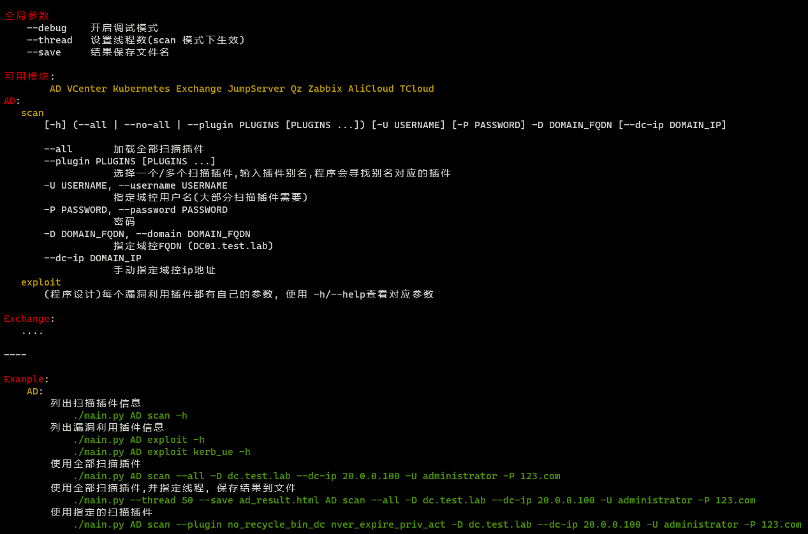
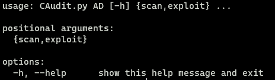
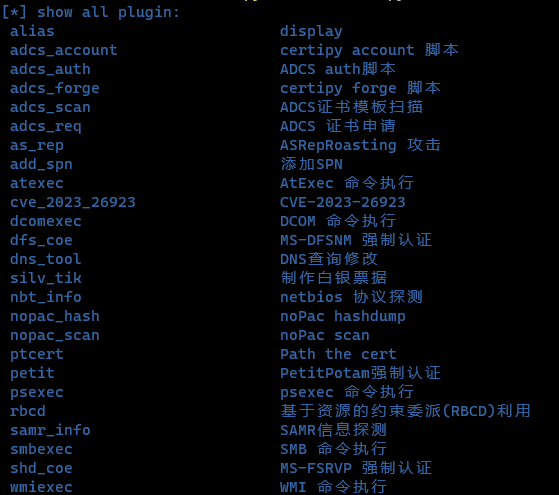
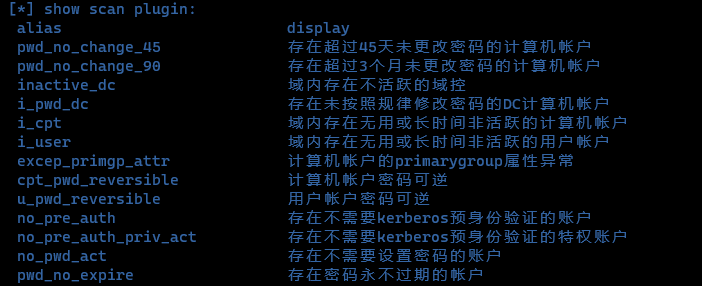
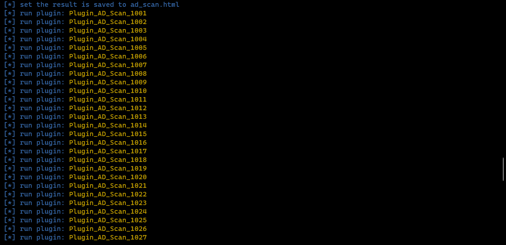
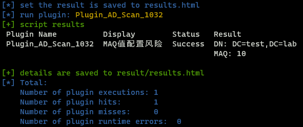

## 描述

十大集权设施基线扫描工具

- AD、K8s、VCenter、Excange、JumpServer、齐治堡垒机、天钥堡垒机、Zabbix、阿里云、腾讯云、华为云
- 内置AD基线扫描脚本数量80+、漏洞利用脚本数量40+
- 内置Exchange基线扫描脚本20条，漏洞利用脚本10条
- 内置VCenter基线扫描脚本15条，漏洞利用脚本18条
- 内置K8s漏洞利用脚本8条、JumpServer漏洞利用脚本1条、齐治堡垒机漏洞利用脚本1条
- 内置阿里云漏洞利用脚本8条、腾讯云漏洞利用脚本6条、华为云漏洞利用脚本2条
- 支持结果保存为HTML文件

## Example

显示全局参数和可用模块

```bash
./CAudit.py -h
```



显示每个模块参数(以AD为例)

```bash
./CAudit.py AD -h
```



列出每个模块所有可用插件(以AD为例)

```bash
./CAudit.py AD --list
```



列出每个模块扫描/漏洞利用类型插件(以AD为例)

```bash
./CAudit.py AD scan --list
./CAudit.py AD exploit --list
```



使用全部扫描插件(以AD为例)

```bash
CAudit.py --save ad_scan.html AD scan -u USER -p PASS -d DC.DOMAIN.COM --dc-ip 1.1.1.1 --all
```



使用指定的扫描插件

```bash
./CAudit.py AD scan --plugin i_maq -d DC.DOMAIN.COM --dc-ip 1.1.1.1 --username USER --password PASS
```



### 使用 Docker

使用前先拉最新镜像

`docker pull amulab/center`

运行

`docker run --rm -it amulab/center`

为了方便使用可以先设置别名

`alias center='docker run --rm -it amulab/center'`

再使用`center`命令运行
